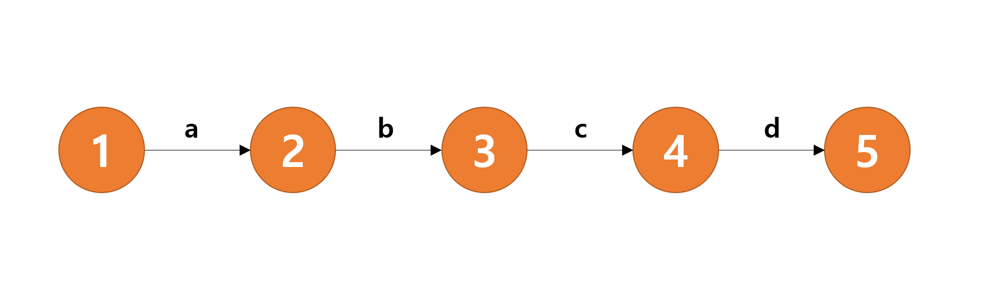

# 벨만 포드(Bellman-Ford) 알고리즘

- **Single Source Shortest Path**에서 음의 가중치를 허용하는 알고리즘
- 벨만 포드는 시간복잡도 측면에서 굉장히 비효율적임
- 그럼에도 이 알고리즘을 수행하는 이유는 바로 **정확성**에 있음.
- 음의 가중치 순환 경로가 존재함으로써 최단 경로에 도달하 수 없는 상황을 검증하기 위함이다.

- [도움이 많이된 블로그 글](https://victorydntmd.tistory.com/104?category=686701)
- [가장 직관적인 설명글](https://bluemoon-1st.tistory.com/17)
- [음의 가중치 사이클 관련해서 도움이 된 글](https://engkimbs.tistory.com/363)

 

 

 

## 의문점

- ~~각 정점을 돌면서 모든 간선에 대한 Relaxation를 해줘야 한다~~. (~~참고로 맨 처음에 구하고자 하는 출발 노드부터 시작해야함~~) 그렇다면 왜 그렇게 다른 정점을 순회하면서 가중치 업데이트를 반복하는 것인가?

> 위의 의문은 내가 완전히 잘못 이해하고 있던 것. Relaxation을 할 때는 노드를 신경쓸 필요가 없다. 시작 노드를 제외한 나머지 노드의 개수 (N-1) 만큼 모든 간선에 대해 Relaxation을 해주면 된다. 즉 만약 시작 노드를 포함한 노드의 개수가 10개고, 간선이 개수가 총 20개라면, 간선을 20개를 9번 순회한다.
>
> 그렇다면 왜 그렇게 하는 것일까? 그건 optimal substructure와 Relaxtion에 대한 개념을 잘 이해해야만 함.

[Optimal Substructure, Relaxation에 대해 설명한 글](https://ratsgo.github.io/data%20structure&algorithm/2017/11/25/shortestpath/)

- 음의 가중치 순환 경로는 어떻게 감지할 수 있는가? 

 

 

 

## 의문점 해결

- ~~각 정점을 순회하면서 직전 정점에서 미처 반영하지 못한 업데이트를 새로 반영할 수 있음~~
- ~~모든 Relax를 끝낸 뒤 마지막에 모든 엣지에 대해서 새로 업데이트를 시도해서 업데이트가 된다면 음의 가중치 순환이 형성된 것. 즉, 오염된 그래프임을 판별할 수 있음.~~
- 위의 말 보단, Relaxation이 끝난 뒤, 한 번더 Relaxation을 시도해서 업데이트가 된다면, 그건 음의 가중치 순환이 형성된 것.

 

 

 

## 내가 이해한 벨만 포드에서의 Relaxation

사실 위의 블로그 글을 봐도 Relaxation을 직관적으로 이해하기에는 다소 무리가 있다. 그래서 여러가지의 상황을 통해 이해한 결과 Relaxation을 모든 간선의 개수 -1 만큼 시행해 주는 이유는 일종의 최악의 상황에서 `INF`를 없애주는 일종의 BFS와 같은 최소 효과를 위해서이다. 이게 무슨말인가 하면, 다음과 같다.

만약 위와 같은 그래프에서 각 간선의 가중치가 모두 1이라고 치자. 노드의 개수는 5개, 시작 노드가 1이라고 가정한다면 이론상 벨만포드의 연산이 끝나기 위해서는 4개의 간선에 대해서 총 5-1 = 4 만큼 순회를 해야한다. 하지만 사실 a, b, c, d 순서대로 간선을 relaxation하게 된다면 한번만에 모든 노드에 대한 최소 경로를 찾을 수 있다. 그렇다면 왜 최대 4만큼은 모든 노드에 대해 `Relaxation`을 해줘야 하는 것일까? 그것은 다음 상황과 같다.

> 순서가 a, b, c, d 가 아닌 d, c, b, a로 간선을 순회해야 하는 상황.

> if u.d != INF && v.d > u.d + w(u, v) 인 경우에 v.d = u.d + w(u, v) 와 같은 노드의 업데이트 가능하다.

생각해보자. 벨만포드에서는 가장 처음 시작 노드인 1을 0으로 초기화하고 나머지는 모두 INF (무한대)로 초기화 한다. 그리고 위와 같이 각 relaxation에 대해서 노드의 최단 거리 정보가 업데이트 되기 위해서는 직전 노드가 INF이어선 안된다. 자, 그럼 다시금 생각해보자.

첫 번째, relaxation에 대해서 d, c, b, a 순으로 간선을 순회하면서 업데이트 될 수 있는 노드는 오로지 2번 노드이다. 나머지 3, 4, 5번 노드는 자신을 가리키는 간선을 순회하는 순간 직전 노드가  INF였기 때문에 업데이트가 될 수 없다. 다시 두번 째, relaxation에 대해서 다시 d, c, b, a 순으로 간선을 순회한다면? 이번에는 3번의 노드만이 최단 거리가 INF에서 2로 정보가 업데이트 될 것이고 나머지 4, 5는 여전히 INF로 남아있을 것이다. 즉, 4, 5번 노드까지 정보가 완벽히 업데이트가 되기 위해서는 총 5 - 1 = 4번 만큼의 `Relaxation`이 필요하게 되는 것이다. 이처럼 `Relaxation`에 대한 직관적 이해는 위와 같은 최악의 상황을 생각해보면 가능할 것이다.

위의 최악의 상황으로부터 확장하여 각 Relxation을 좀 더 직관적으로 어떻게 받아드려 보자!

> 만약 지금 까지 3번의 Relaxation을 거쳤다면 이는 시작노드로부터 3번 건너까지 있는 도달 가능한 노드까지 의 업데이트 가능성을 보장한다는 뜻이다.
>
> 위와 같은 직관적 개념을 받아드릴 떄 주의할 점이 있다. '업데이트의 가능성'을 '보장'만 한다고 했다. 이는 해당 업데이트가 될수도 안될수도 있으며 또한 업데이트가 됐다고 해서 해당 노드의 완전한 최단 거리와 최단 경로를 구했다고 볼 수 없다. 단 한번의 Relaxation만으로도 모든 노드의 업데이트가 이루어질 수도 있다.
>
> 즉, 각 Relaxation은 행해진 시점까지의 그래프에서 시작노드로부터 도달 가능한 노드는 해당 시점까지의 최단거리를 품은 것이다.

 

 

 

위와 같은 내용을 코드로 이해하기 위해선 다음 내가 했던 코딩을 다시 참고해보자

[벨만코드 문제 예시](https://github.com/hangpy/boost_algorithm/tree/master/BAEK_11657)

